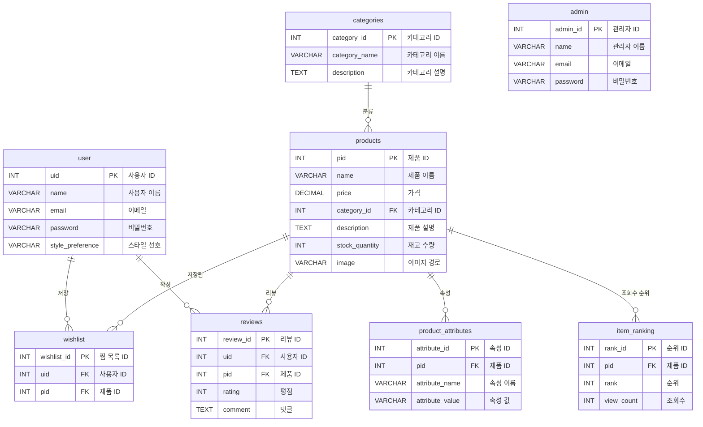

```mermaid
erDiagram
    categories ||--o{ products : "분류"
    user ||--o{ wishlist : "저장"
    products ||--o{ wishlist : "저장됨"
    user ||--o{ reviews : "작성"
    products ||--o{ reviews : "리뷰"
    products ||--o{ product_attributes : "속성"
    products ||--o{ item_ranking : "조회수 순위"

    categories {
        INT category_id PK "카테고리 ID"
        VARCHAR category_name "카테고리 이름"
        TEXT description "카테고리 설명"
    }

    user {
        INT uid PK "사용자 ID"
        VARCHAR name "사용자 이름"
        VARCHAR email "이메일"
        VARCHAR password "비밀번호"
        VARCHAR style_preference "스타일 선호"
    }

    products {
        INT pid PK "제품 ID"
        VARCHAR name "제품 이름"
        DECIMAL price "가격"
        INT category_id FK "카테고리 ID"
        TEXT description "제품 설명"
        INT stock_quantity "재고 수량"
        VARCHAR image "이미지 경로"
    }

    wishlist {
        INT wishlist_id PK "찜 목록 ID"
        INT uid FK "사용자 ID"
        INT pid FK "제품 ID"
    }

    reviews {
        INT review_id PK "리뷰 ID"
        INT uid FK "사용자 ID"
        INT pid FK "제품 ID"
        INT rating "평점"
        TEXT comment "댓글"
    }

    product_attributes {
        INT attribute_id PK "속성 ID"
        INT pid FK "제품 ID"
        VARCHAR attribute_name "속성 이름"
        VARCHAR attribute_value "속성 값"
    }

    item_ranking {
        INT rank_id PK "순위 ID"
        INT pid FK "제품 ID"
        INT rank "순위"
        INT view_count "조회수"
    }

    admin {
        INT admin_id PK "관리자 ID"
        VARCHAR name "관리자 이름"
        VARCHAR email "이메일"
        VARCHAR password "비밀번호"
    }

```
